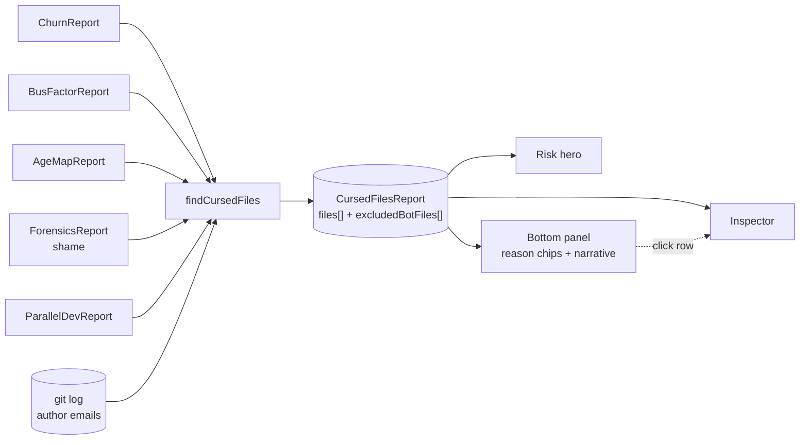

# Cursed Files

**Cursed Files** is the only analyzer that reads no git data of its own. It is a *composite*: it consumes the output of Churn, Bus Factor, Age Map, Shame, and Parallel Dev, and surfaces the files that appear as a problem in several of them at once.

The premise is that single signals mislead. A high-churn file is usually just an active file. A single-author file is usually just a file one person happens to own. Neither is alarming alone. A file that is high-churn *and* narrowly owned *and* accumulating fix commits *and* contested by concurrent editors is a different thing — the risks compound, and no individual analyzer's leaderboard shows the intersection.

Cursed Files answers one question: **"if I can only look at a handful of files, which ones?"**

Because it is an intersection rather than a ranking, **a healthy repository legitimately produces zero cursed files.** That is a passing grade, not a broken panel.

::: tip Screenshot
**TODO:** Capture the Cursed Files analyzer view (sidebar selection, `Risk` hero default tab, `Scatter` alt tab, bottom-panel table with reason chips and an expanded narrative row, right-side Inspector populated). Save to `apps/docs/public/images/analyzers/cursed-files-overview.png`, then replace this callout with ``.
:::

## Quick read

If you only have ten seconds:

- **Top of the screen** (`Risk` hero, default tab) — composite risk heatmap across the repo's directories.
- **Bottom panel** (table) — one row per cursed file, with **reason chips** explaining *why* it scored, plus curse score, churn, and author count. Click a row to expand its narrative; click through to the Inspector for the full per-file profile.
- **Withheld notice** — if any files were excluded as machine-generated churn, they are named above the table. See [Bot-generated churn](#bot-generated-churn-is-withheld).
- **Right-side Inspector** — per-file detail across every contributing analyzer.

## How the curse score is built



**Candidates** are the union of four leaderboards: churn's top files, bus factor's critical files, shame's leaderboard, and parallel dev's hot files. A file that appears on none of them is never considered.

**Churn data is required.** A file on the shame leaderboard with no churn record is dropped — the score, the narrative and the `churn` column all depend on it.

### The point table

Each signal contributes independently, and each contributes a **reason chip** you can read in the panel:

| Signal | Condition | Points | Reason chip |
|---|---|---|---|
| Churn | `churnScore > 75` | **+35** | *Modified in N% of all commits* |
| Churn | `churnScore > 40` | **+15** | *Frequently modified (N commits)* |
| Ownership | bus factor `critical` | **+30** | *Single author owns N% of changes* |
| Ownership | bus factor `high` | **+15** | *Heavily concentrated ownership* |
| Ownership | `> 5` unique authors | **+10** | *N different authors — high coordination overhead* |
| Abandonment | quiet 180d+ before the repo went quiet, and `churnScore > 60` | **+10** | *Heavily churned, then untouched for N days* |
| Shame | `shameScore ≥ 75` | **+20** | *N shame commits detected — this file keeps breaking* |
| Shame | `shameScore ≥ 50` | **+12** | *High rate of fix/revert commits* |
| Shame | `shameScore ≥ 25` | **+6** | *Notable pattern of shame commits* |
| Parallel | `parallelScore ≥ 70` | **+20** | *Heavy parallel development* |
| Parallel | `parallelScore ≥ 40` | **+10** | *Notable parallel development activity* |
| Parallel | `parallelScore ≥ 20` | **+5** | *Some parallel development detected* |

The churn, ownership, shame and parallel tiers are mutually exclusive within their group — a file scores the highest matching tier, not the sum of all of them.

**The qualifying floor is 50**, and the total is capped at 100. Fifty is deliberately hard to reach on one signal: maximum churn alone is 35, and maximum ownership concentration alone is 30. **A file must trip at least two independent analyzers to be cursed at all.** That is the whole design.

### Ownership cuts both ways

Note that ownership contributes at both extremes. One author owning 100% is a bus-factor risk (+30). More than five authors is a coordination risk (+10). The middle — a few authors sharing a file — scores nothing, because that is what healthy ownership looks like.

## Bot-generated churn is withheld

Files whose commits are **majority bot-authored** are scored, then withheld from the list and named separately.

This exists because it was the analyzer's single largest source of false signal. On GitRelic's own repository, the only two cursed files were `CHANGELOG.md` (94% of commits from `semantic-release-bot`) and `apps/cli/package.json` (79%) — machine-written files presented as the repository's biggest risks, actionable by nobody.

- The threshold is a **simple majority** of a file's commits. Below that, a real person still drives most of the changes.
- Detection reuses the shared classifier, which recognises `semantic-release`, `dependabot`, `renovate`, `github-actions`, and `[bot]` accounts on GitHub's noreply domain.
- **AI-authored commits count as human churn**, deliberately. Claude, Copilot, Aider, Cursor and Devin commits classify as `ai`, not `bot` — a person prompted them and owns the result, so the ownership signal still holds. Only unattended automation is machine churn.
- Withheld files are **named, not hidden.** An empty panel that explains itself beats one that looks broken.

## Reading the surfaces

### The hero — `Risk` (default tab)

A composite risk heatmap over the repository's directories, combining ownership, blast radius and shame inputs.

::: warning Known gap
The `Risk` hero does not read the cursed-files report itself — it composes the same underlying signals rather than the composite score. This preset has no curse-score-native hero yet; see [RELIC-343](https://linear.app/nebulord/issue/RELIC-343).
:::

### The bottom panel — table

Cursed Files is one of the few analyzers where the **table earns its space** rather than being replaced by a narrative KPI. The reason chips are the panel's whole value: they are the only place in the dashboard that explains *why* a file scored, and a single-file narrative summary would discard the comparison across files.

Columns are file, reason chips, curse score, churn, and author count. Reason chips are colour-coded by category — ownership, coupling, parallel, and critical (revert/shame/break) — matching the hero's palette.

**Expanding a row** reveals the file's generated narrative, a plain-English sentence such as *"package.json has been touched in 46% of all commits by a single author. That person is a single point of failure."*

### The right-side Inspector

Clicking a row opens the full per-file profile across every contributing analyzer — churn history, ownership breakdown, age, shame commits and parallel windows — so you can verify the composite score against its parts.

## Worked example: React

React, analyzed at two different window lengths, shows how much the window matters:

| Window | Commits analyzed | Cursed files |
|---|---|---|
| `--since` default (12 months) | 889 | **1** |
| `--since all` (13 years) | 19,034 | **2** |

With the default window, one file qualifies:

```
50  packages/react-devtools-shared/src/backend/fiber/renderer.js
    Modified in 7% of all commits · 6 different authors —
    high coordination overhead · Some parallel development detected
```

That is 35 (churn) + 10 (six authors) + 5 (some parallel activity) = **exactly 50**, the floor. It qualifies because three independent analyzers flagged it, not because any one of them screamed.

Widening to the full history swaps the result entirely: `renderer.js` drops out, and `package.json` (768 commits, 130 authors) plus a long-abandoned devtools CSS file take its place. Neither answer is wrong — they answer different questions. **"Is this repo healthy right now?"** and **"what has this repo accumulated over thirteen years?"** are different questions, and Cursed Files will give you different files for each.

One cursed file out of 7,009 is also the point being made above: the intersection is deliberately narrow.

## What action it suggests

- **A file with both churn and ownership chips** — the highest-value target. It changes constantly and one person understands it. Pair on it, or split it before that person leaves.
- **A file with a shame chip** — read the commit log, not the file. Repeated `fix`/`revert` messages usually mean the file's contract is wrong, not its implementation.
- **A file with the abandonment chip** — it was heavily churned, then stopped. Either it stabilised (fine) or it was abandoned mid-refactor (not fine). Cross-reference with [Dead Code](/analyzers/dead-code).
- **Zero cursed files** — genuinely good news. Check the withheld list to confirm nothing was excluded that you would have wanted to see.
- **Everything cursed** — if a large share of your files qualify, the repository has a systemic ownership problem rather than a set of bad files. Start with [Bus Factor](/analyzers/bus-factor) instead.

## Limitations

- **Composite, so it inherits every upstream limitation.** If Churn is misreading a generated file, or Shame is over-weighting the word "fix", Cursed Files amplifies that. Verify a file against its contributing analyzers in the Inspector before acting.
- **Window-sensitive, dramatically so.** As the React example shows, the analyzed window can change the answer completely. The score depends on churn and shame scores that are themselves normalised within the window.
- **The floor is absolute, not relative to repo size.** Fifty points means the same on a 26-commit repo as on a 19,000-commit one, so large mature repositories often produce very few cursed files while small young ones can produce several. Compare a repository against itself over time, not against another repository.
- **Reason chips carry no weights.** The panel tells you a file is cursed for three reasons but not which contributed most — the point values live only inside the analyzer. Tracked at [RELIC-343](https://linear.app/nebulord/issue/RELIC-343).
- **Bot detection is email-pattern based.** A release bot committing under a human's identity is invisible to it, and will still register as human churn.
- **Renames break continuity.** A file's history is attributed to its current path. See [Rename Tracking](/analyzers/renames).
- **Pre-1.0.** The point table, the qualifying floor, and the bot-churn threshold may change. See [CHANGELOG](https://github.com/nebulord-dev/gitrelic/blob/main/CHANGELOG.md).

## Related analyzers

- **[Churn](/analyzers/churn)** — the largest single contributor to the curse score (+35 at the top tier). If a file is cursed mostly on churn, start there.
- **[Bus Factor](/analyzers/bus-factor)** — ownership concentration, contributing at both extremes. The natural next stop for any file carrying an ownership chip.
- **[Shame](/analyzers/shame)** — commit-message forensics. Explains the fix/revert chips, and is usually the most actionable contributing signal because it points at specific commits.
- **[Parallel Dev](/analyzers/parallel-dev)** — concurrent multi-author editing. A cursed file with a parallel chip is contested as well as unstable.
- **[Hotspots](/analyzers/hotspots)** — churn × LOC. Where Cursed Files intersects *social and historical* risk, Hotspots intersects churn with *size*. A file on both lists is the strongest refactor candidate GitRelic can identify.
- **[Web Dashboard](/dashboard/)** — the rendering layer hosting the hero and the reason-chip table.
